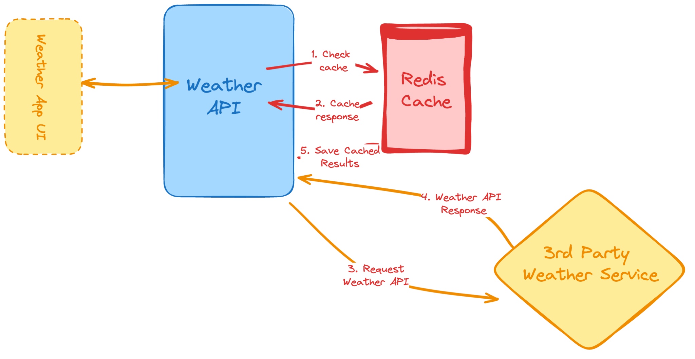

# Wheater API #

## API Documentation
API spec is in [docs](./docs/weather-api-spec.md) directory


## Tech Stack
- Golang (programming language)
- Redis (database cache)
- Docker (Containerized)

## Framework & Library
- [GoFiber](https://gofiber.io/) (HTTP framework)
- [Logrus](https://github.com/sirupsen/logrus) (logger)
- [Godotenv](https://github.com/joho/godotenv) (configuration)

## Architecture


## Installation
### Run app with Golang
1. You have Go installed on your machine.
2. Download ZIP file or use the GIT ``https://github.com/mrizkisaputra/weather-api.git``
3. Open terminal, navigate to directory project ``weather-api``
4. run this command to build ``go build -o weather-api ./cmd``
5. run executable file on cmd windows ``weather-api.exe`` or cmd linux ``./weather-api.exe``

### Run app with Docker
Before you begin, ensure you have met the following requirements:
1. You have Docker installed on your machine.
2. Pull docker image ``docker image pull mrizkisaputra/weather-api``
3. Copy & paste on the terminal:
   ```
    docker run -d \
    --name redis-container \
    --publish 6379:6379 \
    redis
   ```
   ```
    docker run -d \
    --name weather-api-container \
    --env REDIS.HOST=redis-container \
    --env REDIS.PORT=6379 \
    --publish 8080:8080 \
    --link redis-container \
    mrizkisaputra/weather-api:latest
    ```
5. Access API on **postman** or **browser**: ``http://127.0.0.1:8080/api/weather/`` see API [doc](./docs/weather-api-spec.md)